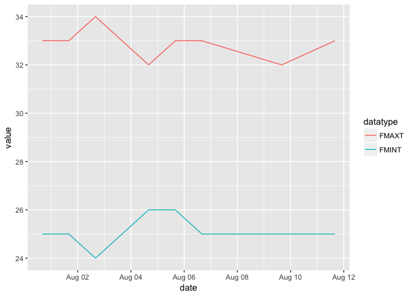

`mywx` : Tools to Query the 'MetMalaysia' Web Service 'API'

The Malaysian Meteorological Web Service API (Application Programming Interface) is a free service offered by Malaysian Meteorological Department to the general public. The service, which serves on top of HTTP, exposes endpoints with JSON response, a human readable yet programmatically parseable data exchange format.

This package provides a small set of functions to retrive locations (as you need the id for a location to use it) and forecast info.

I don't live in Malaysia or use this service at all but it was an easy API to wrap. If you'd like to own this, please just say the word. It needs some work, especially since the "forecast" data returned had no real concept of proper tidy data in mind.

You need a valid token either passed in to `mywx_api_token` or stored in the `MYWX_TOKEN` environment variable, preferably in `~/.Renviron`.

NOTE: Maximum burst requests is 10 per minute and maximum sustained requests is 1,000 per day.

The following functions are implemented:

-   `mywx_districts`: Retrieve valid geopolitical entities (location)
-   `mywx_forecast`: Retrieve forecast data for a location
-   `mywx_states`: Retrieve valid geopolitical entities (location)
-   `mywx_touristdests`: Retrieve valid geopolitical entities (location)
-   `mywx_towns`: Retrieve valid geopolitical entities (location)

### Installation

``` r
devtools::install_github("hrbrmstr/mywx")
```

### Usage

``` r
library(mywx)
library(tidyverse)

# current verison
packageVersion("mywx")
```

    ## [1] '0.1.0'

``` r
mywx_districts()
```

    ## # A tibble: 51 x 6
    ##             id        name locationcategoryid locationrootid latitude longitude
    ##  *       <chr>       <chr>              <chr>          <chr>    <dbl>     <dbl>
    ##  1 LOCATION:17  BATU PAHAT           DISTRICT     LOCATION:1 1.854800  102.9325
    ##  2 LOCATION:18 JOHOR BAHRU           DISTRICT     LOCATION:1 1.465500  103.7578
    ##  3 LOCATION:19      KLUANG           DISTRICT     LOCATION:1 2.025100  103.3328
    ##  4 LOCATION:20 KOTA TINGGI           DISTRICT     LOCATION:1 1.738100  103.8999
    ##  5 LOCATION:21      LEDANG           DISTRICT     LOCATION:1 2.262401  102.6498
    ##  6 LOCATION:22     MERSING           DISTRICT     LOCATION:1 2.431200  103.8405
    ##  7 LOCATION:23        MUAR           DISTRICT     LOCATION:1 2.044200  102.5689
    ##  8 LOCATION:24    NUSAJAYA           DISTRICT     LOCATION:1 1.413590  103.6317
    ##  9 LOCATION:25     SEGAMAT           DISTRICT     LOCATION:1 2.514800  102.8158
    ## 10 LOCATION:26     PONTIAN           DISTRICT     LOCATION:1 1.516380  103.3839
    ## # ... with 41 more rows

``` r
mywx_states()
```

    ## # A tibble: 16 x 5
    ##             id            name locationcategoryid latitude longitude
    ##  *       <chr>           <chr>              <chr>    <dbl>     <dbl>
    ##  1  LOCATION:1           JOHOR              STATE 1.465500  103.7578
    ##  2  LOCATION:2           KEDAH              STATE 6.121040  100.3601
    ##  3  LOCATION:3        KELANTAN              STATE 6.056660  102.2645
    ##  4  LOCATION:4    KUALA LUMPUR              STATE 3.143000  101.6948
    ##  5  LOCATION:5          LABUAN              STATE 4.890934  114.9428
    ##  6  LOCATION:6          MELAKA              STATE 2.231926  102.2943
    ##  7  LOCATION:7 NEGERI SEMBILAN              STATE 2.729700  101.9381
    ##  8  LOCATION:8          PAHANG              STATE 3.807700  103.3260
    ##  9  LOCATION:9    PULAU PINANG              STATE 5.411230  100.3354
    ## 10 LOCATION:10           PERAK              STATE 4.584100  101.0829
    ## 11 LOCATION:11          PERLIS              STATE 6.441400  100.1986
    ## 12 LOCATION:12       PUTRAJAYA              STATE 2.916670  101.7000
    ## 13 LOCATION:13           SABAH              STATE 5.974900  116.0724
    ## 14 LOCATION:14         SARAWAK              STATE 1.583330  110.3333
    ## 15 LOCATION:15        SELANGOR              STATE 3.085070  101.5328
    ## 16 LOCATION:16      TERENGGANU              STATE 5.330200  103.1408

``` r
mywx_towns()
```

    ## # A tibble: 51 x 6
    ##              id        name locationcategoryid locationrootid latitude longitude
    ##  *        <chr>       <chr>              <chr>          <chr>    <dbl>     <dbl>
    ##  1 LOCATION:122  AYER HITAM               TOWN     LOCATION:1   1.9150  103.1808
    ##  2 LOCATION:123  BATU PAHAT               TOWN     LOCATION:1   1.8548  102.9325
    ##  3 LOCATION:124 JOHOR BAHRU               TOWN     LOCATION:1   1.4655  103.7578
    ##  4 LOCATION:125       LABIS               TOWN     LOCATION:1   2.3850  103.0210
    ##  5 LOCATION:126     TANGKAK               TOWN     LOCATION:1   2.2673  102.5453
    ##  6 LOCATION:127        MUAR               TOWN     LOCATION:1   2.0442  102.5689
    ##  7 LOCATION:128       PAGOH               TOWN     LOCATION:1   2.1495  102.7704
    ##  8 LOCATION:129      KLUANG               TOWN     LOCATION:1   2.0251  103.3328
    ##  9 LOCATION:130 KOTA TINGGI               TOWN     LOCATION:1   1.7381  103.8999
    ## 10 LOCATION:131     MERSING               TOWN     LOCATION:1   2.4312  103.8405
    ## # ... with 41 more rows

``` r
mywx_touristdests()
```

    ## # A tibble: 30 x 6
    ##              id              name locationcategoryid locationrootid latitude longitude
    ##  *        <chr>             <chr>              <chr>          <chr>    <dbl>     <dbl>
    ##  1 LOCATION:310     BATU FERINGGI        TOURISTDEST     LOCATION:9  5.47090  100.2453
    ##  2 LOCATION:311     BUKIT BENDERA        TOURISTDEST     LOCATION:9  2.37330  102.5104
    ##  3 LOCATION:312      BUKIT TINGGI        TOURISTDEST     LOCATION:8  2.28720  103.6726
    ##  4 LOCATION:313      BUKIT FRASER        TOURISTDEST     LOCATION:8  3.71260  101.7412
    ##  5 LOCATION:314 CAMERON HIGHLANDS        TOURISTDEST     LOCATION:8  4.48333  101.4500
    ##  6 LOCATION:315         CHERATING        TOURISTDEST     LOCATION:8  4.12557  103.3939
    ##  7 LOCATION:316            DESARU        TOURISTDEST     LOCATION:1  1.54020  104.2680
    ##  8 LOCATION:317 GENTING HIGHLANDS        TOURISTDEST     LOCATION:8  3.39545  101.7792
    ##  9 LOCATION:318             KIJAL        TOURISTDEST    LOCATION:16  4.35000  103.4833
    ## 10 LOCATION:319             LUMUT        TOURISTDEST    LOCATION:10  4.23230  100.6298
    ## # ... with 20 more rows

``` r
glimpse(mywx_forecast("LOCATION:237", "2017-08-13", "2017-08-13"))
```

    ## Observations: 6
    ## Variables: 12
    ## $ locationid       <chr> "LOCATION:237", "LOCATION:237", "LOCATION:237", "LOCATION:237", "LOCATION:237", "LOCATION:...
    ## $ locationname     <chr> "PUTRAJAYA", "PUTRAJAYA", "PUTRAJAYA", "PUTRAJAYA", "PUTRAJAYA", "PUTRAJAYA"
    ## $ locationrootid   <chr> "LOCATION:12", "LOCATION:12", "LOCATION:12", "LOCATION:12", "LOCATION:12", "LOCATION:12"
    ## $ locationrootname <chr> "PUTRAJAYA", "PUTRAJAYA", "PUTRAJAYA", "PUTRAJAYA", "PUTRAJAYA", "PUTRAJAYA"
    ## $ date             <dttm> 2017-08-12 16:00:00, 2017-08-12 16:00:00, 2017-08-12 16:00:00, 2017-08-12 16:00:00, 2017-...
    ## $ datatype         <chr> "FGM", "FGA", "FGN", "FMINT", "FMAXT", "FSIGW"
    ## $ value            <chr> "Cloudy", "Thunderstorms", "Cloudy", "26", "33", "Thunderstorms"
    ## $ latitude         <dbl> 2.91667, 2.91667, 2.91667, 2.91667, 2.91667, 2.91667
    ## $ longitude        <dbl> 101.7, 101.7, 101.7, 101.7, 101.7, 101.7
    ## $ attributes.unit  <chr> NA, NA, NA, "Celcius", "Celcius", NA
    ## $ attributes.code  <chr> NA, NA, NA, NA, NA, "tstorm"
    ## $ attributes.when  <chr> NA, NA, NA, NA, NA, "Afternoon"

``` r
vals <- mywx_forecast("LOCATION:237", "2017-08-01", "2017-08-13")

glimpse(vals)
```

    ## Observations: 51
    ## Variables: 12
    ## $ locationid       <chr> "LOCATION:237", "LOCATION:237", "LOCATION:237", "LOCATION:237", "LOCATION:237", "LOCATION:...
    ## $ locationname     <chr> "PUTRAJAYA", "PUTRAJAYA", "PUTRAJAYA", "PUTRAJAYA", "PUTRAJAYA", "PUTRAJAYA", "PUTRAJAYA",...
    ## $ locationrootid   <chr> "LOCATION:12", "LOCATION:12", "LOCATION:12", "LOCATION:12", "LOCATION:12", "LOCATION:12", ...
    ## $ locationrootname <chr> "PUTRAJAYA", "PUTRAJAYA", "PUTRAJAYA", "PUTRAJAYA", "PUTRAJAYA", "PUTRAJAYA", "PUTRAJAYA",...
    ## $ date             <dttm> 2017-08-06 16:00:00, 2017-08-06 16:00:00, 2017-08-06 16:00:00, 2017-08-06 16:00:00, 2017-...
    ## $ datatype         <chr> "FGM", "FGA", "FGN", "FMINT", "FMAXT", "FSIGW", "FGM", "FGA", "FGN", "FMINT", "FMAXT", "FS...
    ## $ value            <chr> "No rain", "Rain", "No rain", "25", "33", "Rain", "Rain", "Rain", "No rain", "24", "34", "...
    ## $ latitude         <dbl> 2.91667, 2.91667, 2.91667, 2.91667, 2.91667, 2.91667, 2.91667, 2.91667, 2.91667, 2.91667, ...
    ## $ longitude        <dbl> 101.7, 101.7, 101.7, 101.7, 101.7, 101.7, 101.7, 101.7, 101.7, 101.7, 101.7, 101.7, 101.7,...
    ## $ attributes.unit  <chr> NA, NA, NA, "Celcius", "Celcius", NA, NA, NA, NA, "Celcius", "Celcius", NA, NA, NA, NA, "C...
    ## $ attributes.code  <chr> NA, NA, NA, NA, NA, "rain", NA, NA, NA, NA, NA, "rain", NA, NA, NA, NA, NA, "sunny", NA, N...
    ## $ attributes.when  <chr> NA, NA, NA, NA, NA, "Afternoon", NA, NA, NA, NA, NA, "Morning and Afternoon", NA, NA, NA, ...

``` r
dplyr::filter(vals, datatype %in% c("FMINT", "FMAXT")) %>% 
  mutate(value = as.numeric(value)) %>% 
  ggplot(aes(date, value, color = datatype)) +
  geom_line()
```



### Test Results

``` r
library(mywx)
library(testthat)

date()
```

    ## [1] "Sat Aug 12 23:36:00 2017"

``` r
test_dir("tests/")
```

    ## testthat results ========================================================================================================
    ## OK: 0 SKIPPED: 0 FAILED: 0
    ## 
    ## DONE ===================================================================================================================
